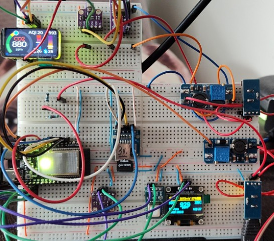

# Air Quality Station

This is the project for ESP32 C6 board with 1,47 LCD display from Waveshare.

This device should report following information:
- CO2 ppm measurement
- temperature
- humidity
- atmospheric pressure
- AQI
- staistics

The main functionality:
- save all measurements into the local SD card database
- draw different graphs for each sensor measure history statistics at OLED display
- integrate all sensors in Home Assistant if the device is connected to WiFi and HA is added
- start Wifi in `AP mode` with `captive_portal` modified to show all measures and `js` graphs

# Hardware

## Board

- Main: `ESP32 C6` with OLED 1.47 from [Waveshare](https://www.waveshare.com/wiki/ESP32-C6-LCD-1.47)
- Test: `ESP32 C6` [Nano](https://github.com/wuxx/nanoESP32-C6/blob/master/README_en.md)


## CO2

`SDC41` CO2 sensor (generic from Ali) [Official link](https://sensirion.com/products/catalog/SCD41)

## Temperature, humidity, pressure

`BME680` Generic sensor from Ali [ESPHome doc](https://esphome.io/components/sensor/bme680.html)

## Display

Test: simple I2C display monochromatic.

# SQLite

Having issues with SQLite and memory..

```log
Opened database successfully
I (263575) sqlite: Opened database: /sdcard/stats.db, resp: 0
INSERT INTO air_temp_stats VALUES (26.844532, 35.619118, 983.710632, 124.074074, 46, 5000);
SQL error: out of memory
E (263645) sqlite: Cannot insert at /sdcard/stats.db
I (312855) sensor-co2: CO2:810ppm; Temperature:120.0; Humidity:3.5
Opened database successfully
I (312855) sqlite: Opened database: /sdcard/stats.db, resp: 0
INSERT INTO co2_stats VALUES (120.017998, 3.524000, 810, 5000);
E (312895) dma_utils: esp_dma_capable_malloc(181): Not enough heap memory
E (312895) diskio_sdmmc: sdmmc_write_blocks failed (0x101)
SQL error: disk I/O error
E (312905) sqlite: Cannot insert at /sdcard/stats.db
I (313535) sensor-bme680: t:26.81C; Humidity:35.63%; Pressure:983.76hpa; Resistance:126.32; Stable:yes: AQI:46 (Moderate)
Opened database successfully
I (313535) sqlite: Opened database: /sdcard/stats.db, resp: 0
INSERT INTO air_temp_stats VALUES (26.809620, 35.632950, 983.760254, 126.319756, 46, 5000);
SQL error: out of memory
E (313545) sqlite: Cannot insert at /sdcard/stats.db
```

# Etc

Some other stuff for battery power and casing is needed.

# Help

Saving space and move setup instructions and how to [here](doc/README.md):

Example setup based on official demo with LVGL and graphics from Square Line Studio: https://github.com/trianglesis/ESP32-C6-LCD-1.47-Test-LVGL

# Project




# Old

There is an old version I made for education.

- Old version: [read](https://github.com/trianglesis/Air_Quality_station/blob/0f882de520a3a1b63564a4ebc3921752ade938d1/README.md)

# End