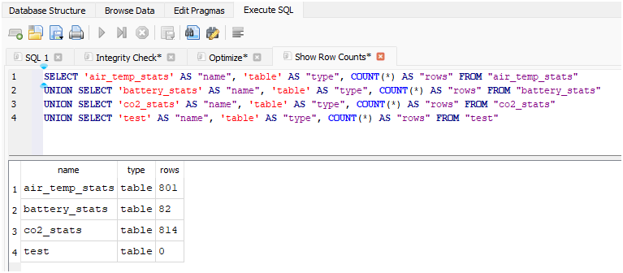

# How to

Will add here compiled and short desctiptions for project modules and setup.

## ESP32

Most options for the board itself.

- Kconfig [doc](https://docs.espressif.com/projects/esp-idf-kconfig/en/latest/kconfiglib/language.html)

### Little FS - SPI flash partition

Create custom partition to save config data from sensors and small html page.

- Update `menuconfig` - `ESPTOOLPY_FLASHSIZE`
  - (8Mb) For ESP32C6 test board
  - (4Mb) For ESP32C6 WaveShare LCD board
- Update `menuconfig` - `PARTITION_TABLE_TYPE`

```csv
# Common partitions above
littlefs,   data,   littlefs,  ,            2000K,
```

- Update `CMakeLists.txt` root project


```txt
# Note: you must have a partition named the first argument (here it's "littlefs")
# in your partition table csv file.
littlefs_create_partition_image(littlefs ../flash_data FLASH_IN_PROJECT)
```

Path in project: `{PROJ_ROOT}/flash_data` will be used to upload files into SPI flash from build!

Initial files:
- `index.html` - dummy index page to show that LittleFS is runing and WebServer is too.
- `upload_script.html` - to upload files with the webserver to SD card


# Wifi

- Work in AP mode if no known network available.
  - Start `Web Server`
- Connect to known network and send data to Home Assistant
  - Don't use AP
  - Start `Web Server` with `File Upload` feature


# Display

[LVGL](../managed_components/idf_components.md)

[ICONS](https://www.flaticon.com/search?word=gauge)


## Simple OLED

- [ALi](https://www.aliexpress.com/item/1005006035385704.html)
- [Setup example](https://github.com/trianglesis/Monochromatic_168x64/blob/dd3de94a450a443e910fca3291d5ad1612539b91/README.md)

```txt
128*64 LED display module for Arduino, supports many control chip.
Fully compatible with for Arduino, 51 Series, MSP430 Series, STM32 / 2, CSR IC, etc.
Ultra-low power consumption: full screen lit 0.08W
Super high brightness and contrast are adjustable
With embedded driver/controller
Interface type is IIC
Pin Definition: GND, VCC ,SCL, SDA
Pins: 4 pins
Voltage: 3V ~ 5V DC
Working Temperature: -30 ° ~ 70 °
Drive Duty: 1/64 Duty
High resolution: 128 * 64
Panel Dimensions: 26.70* 19.26* 1.85mm/1.03*0.76*0.07 inch(approx)
Active Area: 21.74* 11.2mm /0.86*0.44 inch(approx)
Driver IC: SSD1306
```

Detect address: `0x3c`

```text
i2c-tools> i2cdetect
     0  1  2  3  4  5  6  7  8  9  a  b  c  d  e  f
00: 00 -- -- -- -- -- -- -- -- -- -- -- -- -- -- --
10: -- -- -- -- -- -- -- -- -- -- -- -- -- -- -- --
20: -- -- -- -- -- -- -- -- -- -- -- -- -- -- -- -- 
30: -- -- -- -- -- -- -- -- -- -- -- -- 3c -- -- --
40: -- -- -- -- -- -- -- -- -- -- -- -- -- -- -- -- 
50: -- -- -- -- -- -- -- -- -- -- -- -- -- -- -- --
60: -- -- 62 -- -- -- -- -- -- -- -- -- -- -- -- --
70: -- -- -- -- -- -- -- 77 -- -- -- -- -- -- -- --
```

- Show info

SquareLine Studio project is easily installed:


Here is an attempt to draw an `invisible` line just to mark the border between different pixel colour matrixes.


This is a pixel border between two colour zones:


It seems like this border is sitiated between 15th and 16th pixel.

## LVGL

Check float enabled, or UI will not show you float numbers.

`LV_USE_FLOAT`

# SD Card

- Save logs
- Save sensor states betweeen powercycles
  - Last status
  - Last calibration
- Save other statuses
  - Wifi statistics
  - Battery

# Web Server

- At local Wifi
  - Allow upload and download files to and from SD card
    - Update HTML files with this feature
- At AP mode
  - Show Sensors statistics for last 5,30,60 minutes and longer
  - Graphs and JS

NOTE: About memory usage: `TCP connections retain some memory even after they are closed due to the TIME_WAIT state. Once the TIME_WAIT period is completed, this memory will be freed.`

# File server

CURL example:

```shell
curl -X POST --data-binary @sd_card/index.html  http://192.168.1.225:80/upload/index.html
curl -X POST --data-binary @index.html  http://192.168.1.225:80/upload/index.html
curl -X POST http://192.168.1.225:80/delete/index3.txt

# New added replace ARG
curl -X POST --data-binary @index.html  http://192.168.1.225:80/upload/index.txt?replace=1
File uploaded successfully
```

Can be used also with web: `http://192.168.1.197/download/`
- You should see dir and files

Check `FATFS_LONG_FILENAMES` to upload files with >3 chars in extension!
- [link](https://stackoverflow.com/a/72530185)

# Sensors

- `SCD40` for CO2
- `BME680` for temperature, humidity and pressure
  - Use to calibrate CO2 sensor too

# I2C

- Using new `master_i2c.h` driver from IDF 5.4.1

Test proper connections:

```log
I (231) main_task: Returned from app_main()
i2c-tools> i2cdetect
     0  1  2  3  4  5  6  7  8  9  a  b  c  d  e  f
00: 00 -- -- -- -- -- -- -- -- -- -- -- -- -- -- --
10: -- -- -- -- -- -- -- -- -- -- -- -- -- -- -- --
20: -- -- -- -- -- -- -- -- -- -- -- -- -- -- -- --
30: -- -- -- -- -- -- -- -- -- -- -- -- -- -- -- --
40: -- -- -- -- -- -- -- -- -- -- -- -- -- -- -- --
50: -- -- -- -- -- -- -- -- -- -- -- -- -- -- -- --
60: -- -- 62 -- -- -- -- -- -- -- -- -- -- -- -- -- 
70: -- -- -- -- -- -- -- 77 -- -- -- -- -- -- -- --
i2c-tools> 
```

Always check if PINs are added correctly!

i2cconfig  --port=0 --freq=100000 --sda=9 --scl=18


## Components details

[Read](components.md)

## IDF Components

[Read](../managed_components/idf_components.md)

# ADC

For measuring battery charge.

Battery 18650 cell in the case with charge\discharge\overcharge usb-c module is connected to the board via voltage bust module. 
- Charging module if giving 4.2 volts.
- Bosster is giving 5.03 volts.
- Voltage divider is dropping voltage to 0.333V

## Voltage diviner

[Voltage Divider](https://raw.org/tool/voltage-divider-calculator/)

- Using 100K and 10K resistors from example.
- UPD: Switched `47K` and `100K`, now using `100K` as drop to ground `(neutral, negative)` and `47K` as measuring protectionf for ADC `pin 0`. 

Now it shows `3247mV` which is closer to real.

## PIN ACD

ESP32 C6 have a `PIN 0` with `ADC1_CH0` use it.

Real voltage formula from [doc](https://randomnerdtutorials.com/power-esp32-esp8266-solar-panels-battery-level-monitoring/)

```text
Vout = (Vin*R2)/(R1+R2)

Vout = (4.2 * 100000) / (10000 + 100000) = 3.8V
              420000  /  110000          = 3.8 - bit extra for GPIO

Vout = (4.2 * 100000) / (20000 + 100000) = 3.5V
              420000  /  120000          = 3.5 - bit extra for GPIO

New 47k for even lower voltage
Vout = (4.2 * 100000) / (47000 + 100000) = 2.8V
              420000  /  147000          = 2.8 - this is battery 100% charged

OR reversed (used old 10K, now replaced with 47K)

Vout = (4.2 * 10000) / (10000 + 100000)   = 380mV
              42000  /  110000            = 380mV - this is battery 100% charged
```

## Get percentage

Linear interpolation:

```text
We know:
- MAX voltage       x1  - Get this value from full charged battery under the real load.
- MIN voltage       x2  - Get this value as soon as battery dies or powered off by charging board protectiion.
- MAX percent:      y1  - Desired 100%
- MIN percent:      y2  - Minimal possible charge 0.1% or 1%
- Current voltage   x   - From ADC calubrated output

Don't know
- Current percent:  y   - we need to calculate it using linear interpolation
```

By the formula:

```cpp
float max_perc = 100.0;
float min_perc = 0.1;
float max_volt = 2590.0;  // Fully charged, under esp32 load
float min_volt = 2043.0;  // Fully discharged, 
float batteryLevel = max_perc + (((battery_readings.voltage_m - max_volt) * (min_perc -  max_perc)) / (min_volt - max_volt));

// Some code ...
ESP_LOGI(TAG, "RAW: %d; Cali: V:%d; Converted V %d; Battery percentage: %d", battery_readings.adc_raw, battery_readings.voltage_m, battery_readings.voltage_m, battery_readings.percentage);
```

Result:

```log
I (1001528) adc-battery: ADC1 Channel[0] Raw Data: 2529
I (1001528) adc-battery: ADC1 Channel[0] Cali Voltage: 2542 mV
I (1001528) adc-battery: RAW: 2529; Cali: V:2542; Converted V 2542; Battery percentage: 90
```

Measurements are a bit off, sometimes dropping to from 93% to 50% and than back. 
Maybe it can become better if we use continuoius mode or measure oneshot for three times in a row getting the max value.


# Battery power

Cannot start:

`I BOD: Brownout detector was triggered`

[Doc](https://randomnerdtutorials.com/power-esp32-esp8266-solar-panels-battery-level-monitoring/)
[Reddit comment](https://www.reddit.com/r/esp32/comments/sa73xs/comment/htsybyz/)

Must change the power scheme.
This converter is probably cheap and unstable, can only work with esp32 5V if no Wifi used.


Temporary solution: add wifi Off option, and skip wifi AP\STA, Webserver and captive portal setup.
The board is working fine now.

# SQLite

Having issues with SQLite and memory..

```
I (492) heap_init: Initializing. RAM available for dynamic allocation:
I (498) heap_init: At 40841BF0 len 0003AA20 (234 KiB): RAM
I (503) heap_init: At 4087C610 len 00002F54 (11 KiB): RAM
I (508) heap_init: At 5000001C len 00003FCC (15 KiB): RTCRAM
```

```log
I (8244) co2station: INIT MEMORY
                Before: 249032 bytes
                After: 53304 bytes
                Delta: -195728


I (8244) main_task: Returned from app_main()
I (8434) adc-battery: Try: 5; measured voltage: 2749 mV; max measured during this cycle: 2766 mV
I (8684) adc-battery: Try: 6; measured voltage: 2766 mV; max measured during this cycle: 2766 mV
I (8934) adc-battery: Try: 7; measured voltage: 2749 mV; max measured during this cycle: 2766 mV
I (9184) adc-battery: Try: 8; measured voltage: 2750 mV; max measured during this cycle: 2766 mV
I (9434) adc-battery: Try: 9; measured voltage: 2766 mV; max measured during this cycle: 2766 mV
I (9684) adc-battery: RAW: 2753; Cali: V:2766; Converted V 2766; Battery percentage: 135
I (9684) sqlite: MEMORY for TASK
        Before: 58204 bytes
        After: 51716 bytes
        Delta: -6488


Opened database successfully
INSERT INTO battery_stats VALUES (2753, 2, 2766, 135, 2766, 60000, 10);
Operation done successfully
I (9984) sqlite: SQL routine ended, DB is closed: /sdcard/stats.db
W (11974) wifi:<ba-add>idx:1, ifx:0, tid:0, TAHI:0x100cc0c, TALO:0x42b84862, (ssn:0, win:64, cur_ssn:0), CONF:0xc0000005
I (12954) sensor-co2: CO2:833ppm; Temperature:64.7; Humidity:92.4
I (12954) sqlite: MEMORY for TASK
        Before: 57900 bytes
        After: 51412 bytes
        Delta: -6488


Opened database successfully
INSERT INTO co2_stats VALUES (64.657997, 92.390999, 833, 5000);
Operation done successfully
I (13264) sqlite: SQL routine ended, DB is closed: /sdcard/stats.db
I (13634) sensor-bme680: t:25.88C; Humidity:35.52%; Pressure:983.85hpa; Resistance:700.87; Stable:no: AQI:65 (Excellent)
I (13634) sqlite: MEMORY for TASK
        Before: 57684 bytes
        After: 51196 bytes
        Delta: -6488


Opened database successfully
INSERT INTO air_temp_stats VALUES (25.875751, 35.523434, 983.849060, 700.869812, 65, 5000);
SQL error: out of memory
E (13934) sqlite: Cannot insert at /sdcard/stats.db
I (62954) sensor-co2: CO2:803ppm; Temperature:38.0; Humidity:19.2
I (62954) sqlite: MEMORY for TASK
        Before: 40044 bytes
        After: 33556 bytes
        Delta: -6488


I (63134) wifi:removing station <10:5a:17:21:7a:6e> after unsuccessful auth/assoc, AID = 0
W (63134) wifi:rm mis
I (63134) wifi:new:<3,0>, old:<3,0>, ap:<3,1>, sta:<3,0>, prof:1, snd_ch_cfg:0x0
Opened database successfully
INSERT INTO co2_stats VALUES (37.992001, 19.174999, 803, 5000);
E (63254) dma_utils: esp_dma_capable_malloc(181): Not enough heap memory
E (63254) diskio_sdmmc: sdmmc_write_blocks failed (0x101)
SQL error: disk I/O error
E (63254) sqlite: Cannot insert at /sdcard/stats.db
I (63674) sensor-bme680: t:26.60C; Humidity:35.55%; Pressure:983.86hpa; Resistance:39.43; Stable:yes: AQI:29 (Unhealthy)
I (63674) sqlite: MEMORY for TASK
        Before: 21328 bytes
        After: 14840 bytes
        Delta: -6488


Opened database successfully
INSERT INTO air_temp_stats VALUES (26.598278, 35.554367, 983.856689, 39.432659, 29, 5000);
SQL error: out of memory
E (63924) sqlite: Cannot insert at /sdcard/stats.db
I (112954) sensor-co2: CO2:804ppm; Temperature:118.0; Humidity:85.3
I (112954) sqlite: MEMORY for TASK
        Before: 11984 bytes
        After: 11984 bytes
        Delta: 0


I (113634) sensor-bme680: t:26.85C; Humidity:35.52%; Pressure:983.85hpa; Resistance:66.98; Stable:yes: AQI:37 (Unhealthy)
I (113634) sqlite: MEMORY for TASK
        Before: 11984 bytes
        After: 11984 bytes
        Delta: 0

```



Reduced page size to 512

Looks promising

```log
Opened database successfully
INSERT INTO air_temp_stats VALUES (25.555319, 36.721657, 984.770874, 147.447189, 48, 5000);
Operation done successfully
I (8564035) sqlite: SQL routine ended, DB is closed: /sdcard/stats.db
I (8612955) sensor-co2: CO2:577ppm; Temperature:12.7; Humidity:41.8
I (8612955) sqlite: MEMORY for TASK
        Before: 67208 bytes
        After: 60720 bytes
        Delta: -6488


Opened database successfully
INSERT INTO co2_stats VALUES (12.688000, 41.806000, 577, 5000);
Operation done successfully
I (8613255) sqlite: SQL routine ended, DB is closed: /sdcard/stats.db
I (8613645) sensor-bme680: t:25.56C; Humidity:36.64%; Pressure:984.78hpa; Resistance:148.49; Stable:yes: AQI:48 (Moderate)
I (8613645) sqlite: MEMORY for TASK
        Before: 67208 bytes
        After: 60720 bytes
        Delta: -6488


Opened database successfully
INSERT INTO air_temp_stats VALUES (25.560307, 36.635235, 984.782410, 148.492905, 48, 5000);
Operation done successfully
I (8613995) sqlite: SQL routine ended, DB is closed: /sdcard/stats.db
I (8662955) sensor-co2: CO2:702ppm; Temperature:124.8; Humidity:37.1
I (8662955) sqlite: MEMORY for TASK
        Before: 67236 bytes
        After: 60748 bytes
        Delta: -6488


Opened database successfully
INSERT INTO co2_stats VALUES (124.797997, 37.119999, 702, 5000);
Operation done successfully
I (8663285) sqlite: SQL routine ended, DB is closed: /sdcard/stats.db
I (8663645) sensor-bme680: t:25.59C; Humidity:38.06%; Pressure:984.75hpa; Resistance:145.27; Stable:yes: AQI:48 (Moderate)
I (8663645) sqlite: MEMORY for TASK
        Before: 67244 bytes
        After: 60756 bytes
        Delta: -6488


Opened database successfully
INSERT INTO air_temp_stats VALUES (25.593348, 38.058575, 984.750854, 145.273209, 48, 5000);
Operation done successfully
I (8663945) sqlite: SQL routine ended, DB is closed: /sdcard/stats.db
```

Nope, refreshing WEB server upload page a few times:

```log
Opened database successfully
INSERT INTO co2_stats VALUES (-17.389999, 44.016998, 633, 5000);
Operation done successfully
I (8913265) sqlite: SQL routine ended, DB is closed: /sdcard/stats.db
I (8913645) sensor-bme680: t:25.64C; Humidity:37.98%; Pressure:984.71hpa; Resistance:143.16; Stable:yes: AQI:48 (Moderate)
I (8913645) sqlite: MEMORY for TASK
        Before: 46580 bytes
        After: 40092 bytes
        Delta: -6488


Opened database successfully
INSERT INTO air_temp_stats VALUES (25.639477, 37.975685, 984.709900, 143.162384, 48, 5000);
SQL error: out of memory
E (8914005) sqlite: Cannot insert at /sdcard/stats.db
```

# Debug and etc


## JTAG

- [JTAG](https://docs.espressif.com/projects/esp-idf/en/v5.4.1/esp32c6/api-guides/jtag-debugging/index.html)

With and without LP core

```txt
openocd -f board/esp32c6-builtin.cfg
openocd -f board/esp32c6-lpcore-builtin.cfg

# Separate PS
d:\.espressif\tools\openocd-esp32\v0.12.0-esp32-20241016\openocd-esp32\bin\openocd.exe -f board/esp32c6-builtin.cfg
d:\.espressif\tools\openocd-esp32\v0.12.0-esp32-20241016\openocd-esp32\bin\openocd.exe -f board/esp32c6-lpcore-builtin.cfg
```

```text
ESP_CONSOLE_UART
ESP_CONSOLE_SECONDARY
```

## Build images

When moving from large test ESP32 with 8mb SPI I have a problem:

`E (535) spi_flash: Detected size(4096k) smaller than the size in the binary image header(8192k). Probe failed.`

Check `ESPTOOLPY_FLASHSIZE` should be 4Mb for Waveshare and 8Mb for bigger test board I use.

## I2C Problems between boards

Can't get I2C bus work after migration between boards.

- CO2 Sensor shows 0ppm `I (12491) sensor-co2: CO2:0ppm; Temperature:-45.0; Humidity:0.0`
- Temp sensor shows zeros also `I (24201) sensor-bme680: t:0.00C; Humidity:0.00%; Pressure:0.04hpa; Resistance:0.00; Stable:no: AQI:0 (Hazardous)`

`I2C hardware timeout detected`

Switched sensors between test stands, sensors works fine.
Tested with i2c-tools: both addresses detected

Setup test is OK!

```log
- Init:         Sensor CO2 SCD4x debug info!
I (551) sensor-co2: SCD4x SDA_PIN: 4
I (551) sensor-co2: SCD4x SCL_PIN: 5
I (561) sensor-co2: SCD4x ADDRESS: 0x62
I (561) sensor-co2: SCD4x CO2_MEASUREMENT_FREQ: 5000
I (571) sensor-co2: SCD4x CO2_LED_UPDATE_FREQ: 15000
I (571) sensor-co2: i2c bus is set and not null
I (571) i2c-driver-my: Create I2C master device successfully!
I (581) i2c-driver-my: Tested device address on the I2C BUS = OK!

- Init:         Sensor BME680 debug info!
I (5591) sensor-bme680: BME680 SDA_PIN: 4
I (5601) sensor-bme680: BME680 SCL_PIN: 5
I (5601) sensor-bme680: BME680 CONFIG_BME680_I2C_ADDR_0: 0x76
I (5611) sensor-bme680: BME680 CONFIG_BME680_I2C_ADDR_1: 0x77
I (5611) sensor-bme680: BME680 MEASUREMENT_FREQ: 5000
I (5621) sensor-bme680: i2c bus is set and not null
I (5671) bme680: bme680_setup_heater_profiles: rh_reg_data 75 | gw_reg_data 89
I (5671) bme680: bme680_setup_heater_profiles: rh_reg_data 85 | gw_reg_data 89
I (5681) bme680: bme680_setup_heater_profiles: rh_reg_data 95 | gw_reg_data 89
I (5681) bme680: bme680_setup_heater_profiles: rh_reg_data 105 | gw_reg_data 89
I (5691) bme680: bme680_setup_heater_profiles: rh_reg_data 115 | gw_reg_data 89
I (5701) bme680: bme680_setup_heater_profiles: rh_reg_data 115 | gw_reg_data 89
I (5711) bme680: bme680_setup_heater_profiles: rh_reg_data 105 | gw_reg_data 89
I (5711) bme680: bme680_setup_heater_profiles: rh_reg_data 95 | gw_reg_data 89
I (5721) bme680: bme680_setup_heater_profiles: rh_reg_data 85 | gw_reg_data 89
I (5731) bme680: bme680_setup_heater_profiles: rh_reg_data 75 | gw_reg_data 89
I (5751) i2c-driver-my: Tested device address on the I2C BUS = OK!
I (5751) sensor-bme680: Variant Id          (0x00): 00000000
I (5751) sensor-bme680: Configuration       (0x88): 10001000
I (5751) sensor-bme680: Control Measurement (0x90): 10010000
I (5761) sensor-bme680: Control Humidity    (0x04): 00000100
I (5761) sensor-bme680: Control Gas 0       (0x00): 00000000
I (5771) sensor-bme680: Control Gas 1       (0x19): 00011001
```

Changed pins to 1 and 2 - works fine.

Probably pin 0,1,2 was mixed at the breadboard.

# Old

The old version, make as educational project is here:
- [README.md](https://github.com/trianglesis/Air_Quality_station/blob/0f882de520a3a1b63564a4ebc3921752ade938d1/doc/README.md)